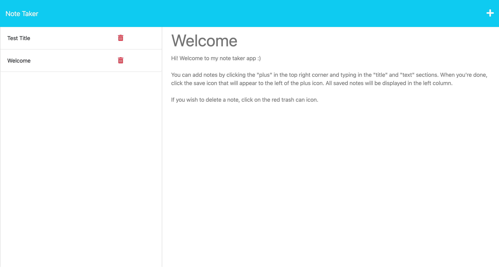
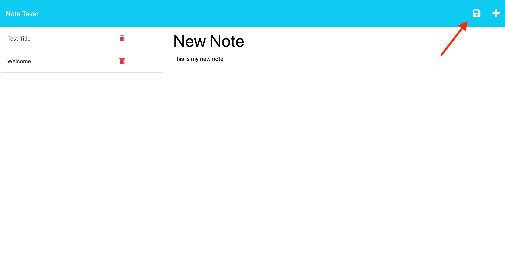
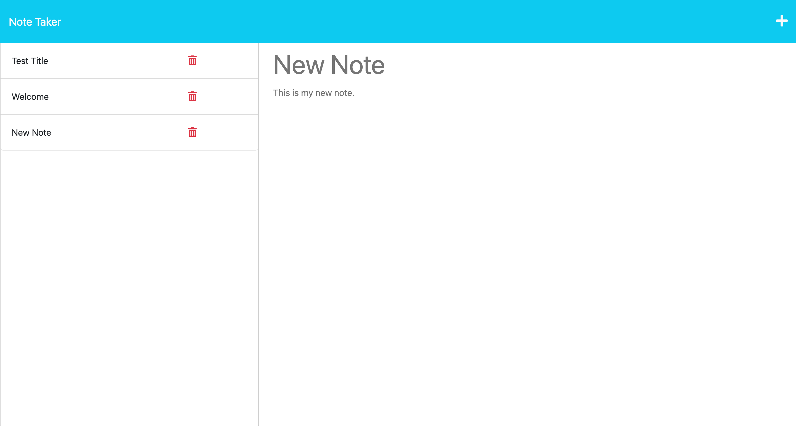
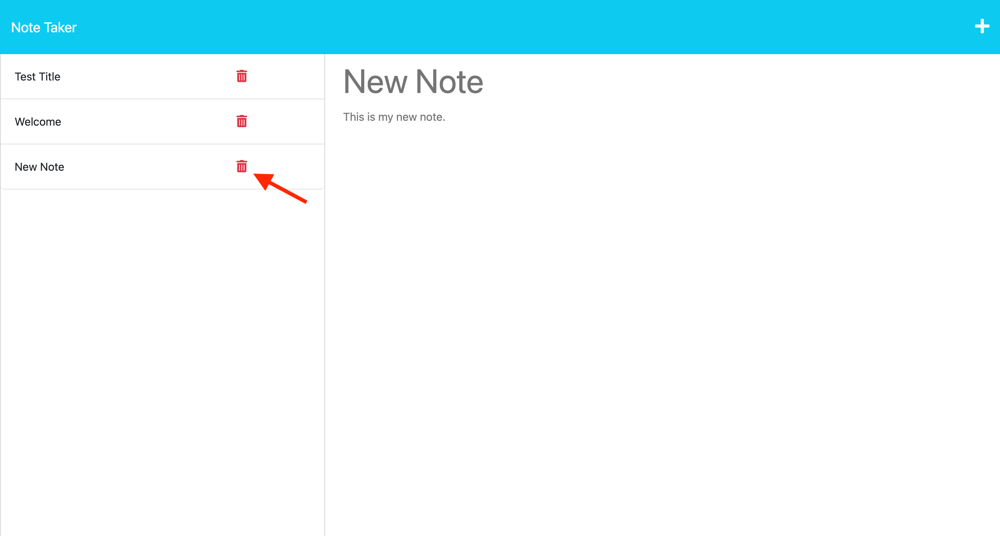

# Note-Taker App

## Description

This website allows users to read existing notes, add new notes, and delete notes.

The application uses `express.js` for the back-end and is deployed on `Heroku` here: https://infinite-shelf-99725-dcdc141ca9fd.herokuapp.com.

The back-end includes get requests to connect the `index.html` file to the root and the `notes.html` file to "https://.../notes". This can be accessed from the main page using the "Get Started" button. Also included are a get request for the notes database which is displayed in the left column, a post request for creating a new note which takes the information typed in the fields and adds it to the database, and a delete request which removes a note from the database when the delete button is clicked.

During this project, I became more comfortable with `express.js`, creating a back-end and connecting it to the font-end, and creating custom api requests. I also learned how to connect to Heroku.

## Table of Contents

- [Installation](#installation)
- [Usage](#usage)
- [Credits](#credits)
- [License](#license)

## Installation

Installation isn't required to use this app; you can access it here: https://infinite-shelf-99725-dcdc141ca9fd.herokuapp.com.

## Usage

To use this application, navigate to https://infinite-shelf-99725-dcdc141ca9fd.herokuapp.com and click the "Get Started" button.

You should be presented with a screen that looks like this.

To create a new note, click the plus icon in the top right corner and start typing in the "Note Title" and "Note Text" fields. When you have text in both fields, a save icon with appear next to the plus icon.

When you're done, click on the save icon. The note will be added to the left column with the list of all notes. If you want to read your new note, just click on the title in the left column and it will appear in the right column.

If you want to delete a note, just click the red trash can icon next to the corresponding note's title in the left column. That note will then be removed from the list.

## Credits

The starter code for this application was provided by UNB Coding Bootcamps. For details on what code was provided, see the feature branch `starter-code`.

## License

For more information about this license, please see the `LICENSE` file or visit https://spdx.org/licenses/MIT.html.

---

## Badges

